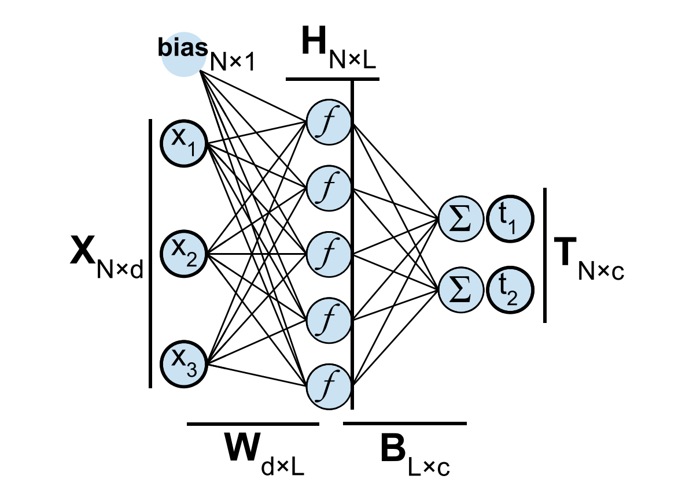

# Minimalist implementation of Extreme Learning Machine



This is an implementation of Extreme Learning Machine as defined in [Extreme Learning Machine: A New LearningScheme of Feedforward Neural Networks](https://www.researchgate.net/publication/4116697_Extreme_learning_machine_A_new_learning_scheme_of_feedforward_neural_networks) paper by Guang-Bin Huang, Qin-Yu Zhu, and Chee-Kheong Siew

## Dependencies

Please always check `requirements.txt` for current dependencies

- Python 3.7
- Numpy 1.17
- Keras 2.3

Keras are not used to design model. It's just a great source of datasets :P Feel free remove it and use your own dataset.

## Usage
Currently tests are run on MNIST dataset (it's a hand-written digits dataset). You can change that inside `test.py` file. 

```bash
python test.py
```

If you want, you can load weights into model by passing them as arguments:
- `beta_init`
- `w_init`
- `bias_init`

You can also change `activation` and `loss` function just pass:
- `activation` - `sigmoid`, `fourier`, `hardlimit`
- `loss` - `mse` (mean square error), `mae` (mean absolute error)

## Todo
- Implement saving/loading model (`h5py`)
- Implement tests
- Implement performance metric